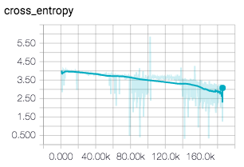
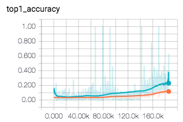
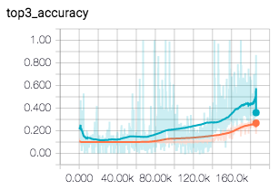

# Judging-a-Book-by-its-Cover

A Tensorflow implementation of the paper : [Judging a Book by its Cover](https://arxiv.org/pdf/1610.09204) that classifies the genres of books by its covers.


## Prerequisites

- Python 3.3+
- [Tensorflow 1.0.0+](https://github.com/tensorflow/tensorflow/)
- [Pillow](https://github.com/python-pillow/Pillow)

## Usage

### Cloning
    git clone https://github.com/LeeKyungMoon/Judging-a-Book-by-its-Cover

### DataSet
Download pre-trained weights of alexnet model and save it to `Judging-a-Book-by-its-Cover/dataset`.

    cd Judging-a-Book-by-its-Cover
    cd dataset
    wget http://www.cs.toronto.edu/~guerzhoy/tf_alexnet/bvlc_alexnet.npy

I imported two csv files of [Uchida Lab dataset](https://github.com/uchidalab/book-dataset).

- `book30-listing-train.csv` : The csv file containing 51,300 rows for training dataset.
- `book30-listing-test.csv` : The csv file containing 5,700 rows for testing dataset.

I already created the image dataset from urls included in the csv files above for training and testing. (But, if you want, you can also download the image files with the file "load_images.py" I uploaded with.)

So download that image dataset from the urls below and also save it to `Judging-a-Book-by-its-Cover/dataset`.

[train_images](https://drive.google.com/uc?id=0B3F_hHS5uhRMaTZmd29SOE9GZ00&export=download) , [test_images](https://drive.google.com/uc?id=0B3F_hHS5uhRMTlYybVlYYVAwYmM&export=download)

    cd Judging-a-Book-by-its-Cover
    cd dataset
    tar -zxvf train_images.tar.gz
    tar -zxvf test_images.tar.gz
    
- `train_images/`: 51,300 images downloaded from the urls in `book30-listing-train.csv`.
- `test_images/`: 5,700 images also downloaded from the urls in `book30-listing-test.csv`.

then the dataset would have the structure described below:

```
Judging-a-Book-by-its-Cover/dataset
├── bvlc_alexnet.npy
│
├── book30-listing-train.csv
│
├── book30-listing-test.csv
│
├── train_images
│   ├── train_filename1.jpg
│   ├── train_filename2.jpg
│   └── ...
│
├── test_images
│   ├── test_filename1.jpg
│   ├── test_filename2.jpg
│   └── ...
```

### Training

```
pip install -r requirements.txt
python train.py
```

### Testing

```
python test.py
```

## Results
The paper compares the performances of two networks : `AlexNet` and `LeNet(for a comparison)` and I implemented AlexNet only.
### AlexNet

Over 180,000 iterations,





The orange line represents the test accuracy.






### LeNet
To be implemented soon.


## Author

[KyungMoon Lee](http://leekyungmoon.com) / leekm8474@gmail.com
