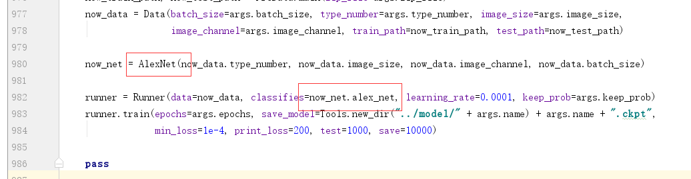
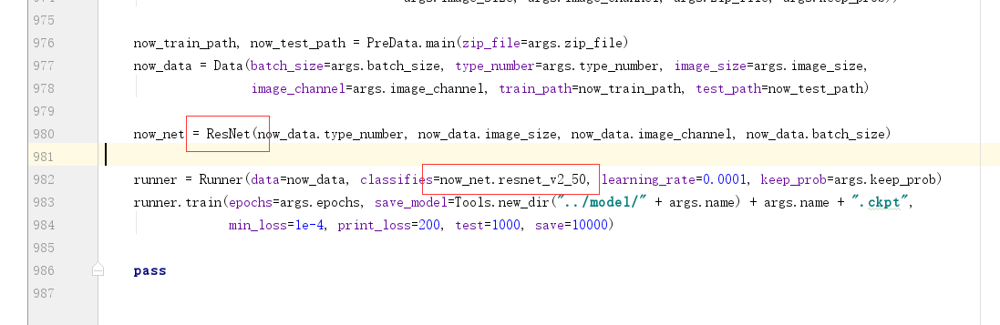

# tensorflow-classification-network
> 用TensorFlow实现各种分类网络（持续更新，现在主要是CNN）

### 用法
- 安装所需python环境
- 只需要简单替换图中的部分，即可实现分类网络的切换

比如换成残差网络：

### data
为了保证分类网络可以运行，上传了少量的数据，可以根据实际需要替换数据

### 分类网络
包含的网络有：
- 简单的5层CNN
- AlexNet
- VGGNet
- InceptionNet
- ResNet
